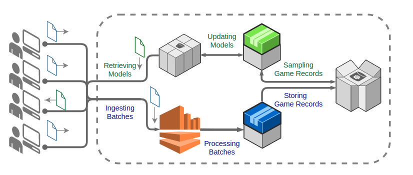

# Distributed RL Training Platform

This repository proposes a generalized and distributed platform to train reinforcement learning game bots in the cloud. Most commercial bots in the industry consist of heuristic approaches, however these methods lack customization. RL has the potential of learning from experience, so that wider variety and more suitable bots can be derived. The benefits of incorporating RL in games are quite interesting, for example, an RL agent can learn to exploit the weaknesses of certain players, allowing the users to faster improve in their performance. These agents can also recommend real-time action or strategies. This platform is designed to be modular and independent from the agent algorithm and games. There are two basic requirements for the game developers to adapt to this platform: i.e. data transmission with the cluster and deep learning inference. One of the downsides of Deep RL is that it requires training computation and storage for the collected experience. To solve this issue, we propose a distributed cluster consisting of two stages, the data collection and the training stage, the figure below shows the overall pipeline. In the first stage, the cluster collects game records from the user necessary for the algorithm to learn the behaviour, these are typically: state, reward, action. Also the more users using the platform the less is requested per user and the more general the algorithm can be. In the second stage, the experience is sampled from the database to execute distributed training. The neural architecture and the weights are often updated into a user accessible storage. The implementation is developed mainly in python using EC2 instances in AWS.

The above figure describes the overall flow in the platform. First, the users often in time upload game records to Kinesis Data Streams in AWS, then a spark streaming cluster (blue EC2) forwards the batches to a Cassandra database. In the meantime, the distributed training (green EC2) developed in ray-RLLIB samples data from cassandra and updates the model parameters. The models are available to the users in a public S3 bucket. Finally, the users may download the models on demand. Alternatively, the bot inference can be conducted by the game server. In case your implementation is on AWS services, you may have to create an account and set-up certain things such as IAM roles and credentials for accessing from your local machine.

This work is still under development. For future work, we aim at further generalize the platform and test in large scale and commercial games. As the platform grows, it would be interesting to display dashboards about the available models and games for ranking, classification and recommendation purposes. 

### 1. Kinesis Streams

Type Kinesis on the search box and hit create a new stream. You will be able to set certain parameters such as the shard number and the retention time. Keep the stream name and the ARN location of the stream since the clients need it for uploading. 

### 2. Apache Spark on EC2.  

an EC2 instance must be initialized (we use a Ubuntu medium instance). For each instance do as follows:

1. Configure the security rules for inbound and outbound traffic.
2. Access the instance via terminal.
3. Install java and python.
4. Install the proper apache spark version in the instance. 
5. Install pip and the cassandra-driver library to allow pyspark to connect to cassandra.
6. Upload your pyspark script to the instance and execute. Make sure to initialize the instances as master or workers. Also, you must modify the pyspark script to connect to the correct kinesis and cassandra addresses. 
7. You may also be interested to access the spark dashboard by accessing the port 4040.

### 3. Cassandra on EC2

In order to configure your Cassandra instance, we do as follows:

1. Configure the security rules for inbound and outbound traffic.
2. Access the instance via terminal.
3. Install java.
4. Install Cassandra in each node.
5. Set up the Cassandra configuration file to operate with your setup (assigning the addresses for each node in the cluster).
6. You may access the Cassandra cql terminal by typing <code>cqlsh</code> in the command line. We create the target table where the games records are stored and sampled.

### 4. Ray cluster on EC2  
As for the trainer cluster, we do as follows:

1. Configure the security rules for inbound and outbound traffic.
2. Access the instance via terminal.
3. Install python 3 and pip
4. Install the following dependencies: pytorch, ray, ray[default], ray[tune], ray[rllib].
5. Define your RL algorithm in ray and execute the script <code>./trainer/trainer.py</code> in your master node and connect your worker nodes to the master node using the correct IP address.

### 5. S3 bucket

A bucket can be easily created at AWS services website. Simply type S3 on the search box and carry out the necessary steps.

### 6. Client

In order to mock a simple game, we reuse the Cartpole gym environment at the <code>./client/</code> directory. Each client must install python with the following dependencies: pytorch, numpy, pandas, boto3, gym,  matplotlib (optional). Once downloaded, execute the script <code>./client/experience_collection.py</code>
